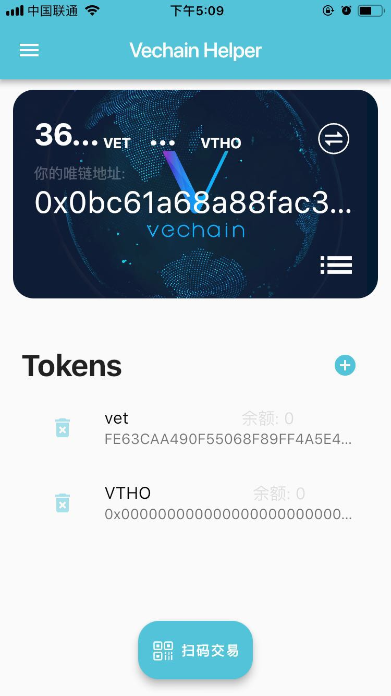

# vechain_helper
一个全栈的唯链支付助手工具

### 目的

作为一个后端程序员, 一直想尝试一下前端项目。 这便是此项目的由来。 此项目将由APP端, Web前端和后端组成。 
APP端使用flutter框架来进行构建的ios&安卓的跨平台app，
后端技术栈则为Golang+mysql。 
web前端暂时只是一个简单的HTML页面。

### 项目截图

### 注意
此项目主要是一个练手项目， 所有的代码均是开源的。 
如果你是一个区块链的开发者, 对于唯链(以太坊与其类似)的地址生成， 签名， 发起交易, ERC20代码转账等感兴趣你可以直接阅读
后端部分相关的代码。
如果你也是一个flutter新手爱好者, 希望此项目的APP能够给你提供一个参考。

### 文件说明